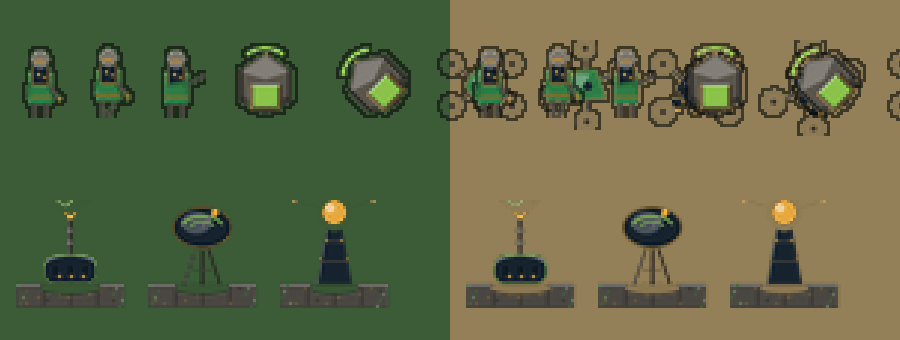

# Sungrid Protocol — Art Direction

## Tone

Lush eco-solarpunk. Renewable power, smart grids, drone logistics, and resilient settlements — hopeful and strategic, not utopian or goofy. This is still a real RTS: the world should look like people building something worth defending, under genuine pressure, not a post-scarcity diorama with no stakes.

## Guardrails

- **Not utopian.** Bases should show wear, improvisation, and defense — sandbags next to solar panels, drone bays bolted onto salvaged structure, not pristine architecture-magazine renders.
- **Not goofy.** No cartoon mascots, no winking irony. The Cryptominer building (morally ambiguous legacy tech repurposed under solar power) is the tone reference: interesting, slightly uneasy, not a joke.
- **Still a Cold-War-adjacent conflict, re-skinned.** Military tension, scouting, raiding, and destruction are real and visible — weapons and defensive structures should read as dangerous, not decorative.

## Readability rules (non-negotiable, ties to Design Pillar 1)

- Every unit and building must have a distinct, readable silhouette at standard RTS zoom — theme never overrides legibility.
- Faction/player color must remain the dominant, unambiguous ownership signal (team-color accents on structures/units), consistent with classic RA-style UI conventions.
- Health/status bars, selection indicators, and UI chrome keep OpenRA's existing conventions until there's a specific, tested reason to deviate — familiarity is a feature for genre-literate players.

## Palette direction

- **Base palette:** greens (living systems, recycling, foliage reclaiming industrial space), warm solar-panel blues/blacks, sun-gold accents for "active/powered" states.
- **Military/industrial counterpoint:** desaturated grays and rust for legacy infrastructure (Cryptominer, salvaged structures) to visually separate "old world tech" from "new grid tech" without needing a second faction yet.
- **Danger/alert states:** reserve existing RTS conventions (red/amber) for low power, under-attack, and Grid Reserve Lockdown countdown states — don't reinvent alert color language.

## Faction visual differentiation (Phase 5+)

Until a second faction is scoped, "faction flavor" means making the single Sungrid Protocol roster visually cohesive and distinct from vanilla RA/Allies/Soviets — not inventing a second full art set. Notes for whenever a second faction is justified: differentiate through material and infrastructure philosophy (e.g. decentralized/drone-based vs. centralized/hardened grid) rather than through tone shifts — both factions should still read as "this world," not swap into a different genre.

## Asset pipeline (Phase 5 planning note)

Before more than one contributor (human or AI-assisted) produces art, lock: sprite resolution and frame conventions matching OpenRA's existing pixel-art pipeline, a shared base palette file, and a naming/sequence convention consistent with `mods/ra`'s existing structure so new sequences drop into the engine's existing tooling without custom loader work. This is a data/content-pipeline decision, not a code decision — see `docs/ARCHITECTURE.md` friction point #4.

**Priority: Solar Array first.** Solar Array (`POWR`/`APWR`) is the building the mod is named after, so it was the first to get dedicated art rather than the reused vanilla RA power plant sprite — see `docs/BACKLOG.md` issue #12. That first pass shipped as a `PngSheet`-format sprite rather than a hand-authored indexed `.shp`, so it does **not** yet establish the final sprite pipeline baseline this section calls for; it proves the palette/tone direction (solar-panel blues, gold power-conduit accent, green reclaiming the base) but still needs a real artist pass, at which point the indexed-palette/`.shp` pipeline baseline should get set properly.

**Follow-up: the rest of the Sungrid-original roster (see `docs/BACKLOG.md` issue #34).** The remaining buildings with no `mods/ra` equivalent — Cryptominer, Datacenter for AI, Drone Bay, Aerial Fabrication Bay, Grid Defense Turret, Smart Grid Relay, Resilience Shelter, Sensor Array, Wind Turbine Array, Hydrogen Plant — plus the two drone units (Recon Drone, Strike Drone) now have dedicated first-pass art too, generated the same programmatic way by `mods/sungrid/bits/gen_concept_art.py`. This closed a real readability bug, not just missing flavor: several of these buildings had been sharing an identical sprite with an unrelated existing building (worst case, `SGTUR`/`SGWND`/the real `SAM` Site all rendered the same sprite), which violates this document's non-negotiable distinct-silhouette rule above. Wind Turbine Array and Hydrogen Plant were deliberately drawn as palette/motif variants of Solar Array's own art rather than new designs from scratch, since they're mechanically just other power buildings — consistent with only drawing genuinely new motifs where the concept itself is new. `SGHAU` (Hauler Drone) was initially left on `HARV`'s chassis for the same reason in the other direction — mechanically just a small resource hauler, not a new concept — but that call was reversed in a follow-up pass: an identical sprite between the two isn't just missing flavor here, it's the exact distinct-silhouette violation this document's rule exists to prevent, and in practice it read as a gameplay bug (a Hauler Drone that looks exactly like an idle/broken Ore Truck, since it collects Scrap rather than Ore). `SGHAU` now has its own hex-chassis cargo-sled silhouette, deliberately not truck-shaped, with a rear cargo canister whose fill level reads its current Scrap load. As with Solar Array, this is flat programmatic art in the locked palette below, not a real artist pass — that remains open follow-up work for the whole roster, not just Solar Array.

**Follow-up: `ARCT`/`DISR` (see `docs/BACKLOG.md` issue #36).** `docs/BACKLOG.md` issue #14 renamed and re-weaponed Flame Tower/Flame Infantry into Arc Turret/Disruptor Trooper but deliberately kept the original `ftur.shp`/`e4.shp` chassis art on the "the models themselves were never the issue, only the weapon" reasoning — the same "easy to adapt" call `SGHAU` originally got, and it turned out to be the same mistake: a player sees a flame-nozzle tower and a flamethrower-armed trooper in the build menu, which reads as fire weapons still being in the game regardless of what the tooltip name says. Both now have dedicated first-pass art: `ARCT` is a squat discharge base with a forked electrode and a small arc bridging the two prongs (no nozzle/fuel-tank silhouette left anywhere, including the build-up animation, which was also switched off the flame-colored `fturmake.shp` reuse); `DISR` is a fully self-contained new infantry sheet — an abstract rotatable humanoid glyph carrying a blue-black-and-gold backpack discharge cell and a green weapon rod, with a gold spark accent standing in for the old flame jet during `shoot`.

**Follow-up: quality pass over the whole programmatic set (see `docs/BACKLOG.md` issue #40).** All of the above — the full issue #12/#34/#36 roster, Solar Array included — got a second, uniform rendering pass in `mods/sungrid/bits/gen_concept_art.py`: 4x supersampled drawing, one consistent top-left key light with lit/shaded edges on every mass, 1px dark readability outlines on all unit frames, genuinely distinct damaged frames (the first pass had a bug that made every building's damaged frame pixel-identical to idle), and sidebar icons rebuilt as opaque cameo cards instead of transparent whole-frame downscales. Frame sizes/counts/layouts are unchanged from the first pass, and it's still programmatic geometry in the locked palette — the real-artist-pass status above is unaffected.

Every other Phase 2 building (the original economy/production roster ported from `mods/ra`) still ships with placeholder/reused stock art.

## Beyond building art: full visual identity (Phase 6/7)

Everything above governs building art specifically. Terrain tilesets, UI chrome (sidebar/build palette/radar frame), cursors, the main menu shell, unit/vehicle/infantry sprites, and audio (announcer voice lines, music) are all still unmodified stock OpenRA/RA assets as of Phase 5 — the single biggest reason the game still visually reads as "reskinned RA" rather than its own project, independent of how distinct the building roster becomes. `docs/ROADMAP.md`'s Phase 6 (world/UI reskin: terrain, chrome, cursors, main menu) and Phase 7 (unit sprites + audio) scope the work to close that gap; the guardrails, palette direction, and readability rules in this document apply equally to that work, not just buildings.

## Phase 6 chrome: first-pass reskin + locked palette (see `docs/BACKLOG.md` issue #13)

A first pass at the Phase 6 chrome deliverable is done: `mods/sungrid/uibits/dialog.png`, `sidebar.png`, and `loadscreen.png`(+`-2x`/`-3x`) are recolored from stock RA's beige/maroon toward this document's palette direction, using the concrete hex values below rather than the palette direction's prose alone. This is a scripted recolor (piecewise hue remap preserving exact canvas dimensions and `chrome.yaml`'s pixel-exact `Regions`/`PanelRegion` rects), not a real artist pass — see `mods/sungrid/uibits/PLACEHOLDER_ART.md` for exactly what's still placeholder and how to replace it. It also does **not** touch cursors or terrain tilesets, which remain out of scope for this pass (see that same file for why).

**Locked palette (hex, sRGB):**

| Role | Hex |
|---|---|
| Living green (primary) | `#2E7D46` |
| Living green (accent) | `#8BC34A` |
| Solar panel blue-black | `#16232E` |
| Sun-gold (active/powered) | `#E8A93D` |
| Alert red/amber | unchanged from stock, per the guardrail above |

**A real finding from doing this pass:** `sidebar.png`'s "no radar built yet" placeholder art and `loadscreen.png` turned out to contain the literal stock Allied chevron and Soviet hammer-and-sickle logos baked into pixel art, not just an unstyled color scheme. Both were replaced with a procedural placeholder emblem rather than left shipping unrelated faction IP while the rest of Phase 6 is still pending — see `PLACEHOLDER_ART.md` for the exact pixel locations if you're doing the real design pass.

### Follow-up pass: full chrome redesign, no stock-derived pixels (see `docs/BACKLOG.md` issue #41)

The recolor above was superseded by a from-scratch redesign: `mods/sungrid/uibits/gen_chrome.py` now generates all of `dialog.png`, `sidebar.png`, `loadscreen*.png`, and the mod icons programmatically — zero pixels derive from stock RA chrome, which was the last reason the UI itself still read as "recolored OpenRA." The visual language ("grid-glass") is built entirely from the locked palette above: solar-panel blue-black surfaces with a faint photovoltaic cell-grid texture, living-green structural frames with the same top-left lit-edge convention as the issue #40 sprite pass, and sun-gold reserved for highlighted/active states, filaments, and the redesigned emblem (a sun rising over a living-green horizon inside a hexagonal grid cell, filaments feeding an outer ring). Faction accents follow the issue #34 identities — Consortium gold, Assembly green. Every `chrome.yaml` pixel rect and canvas size is unchanged. Still programmatic first-pass art, not a human-designer pass — `mods/sungrid/uibits/PLACEHOLDER_ART.md` documents the current state and constraints.

## Phase 6 terrain: first-pass palette reskin (see `docs/BACKLOG.md` issue #18)

A first pass at the temperate tileset (the primary/most-used tileset per `docs/ROADMAP.md`'s Phase 6 deliverables) is done, using a different technique than the chrome pass: rather than editing individual tile sprites, `mods/sungrid/bits/reskin_terrain_palette.py` recolors the **palette**, not the tiles. Classic Westwood-era tile art is a fixed set of 256-color indices into a separate `.pal` file — the actual `.tem` sprite data never changes, only which color each index resolves to — so this carries none of the "a bad tile replacement can break cliff/resource-field boundary visuals across the whole map set" risk `docs/ROADMAP.md`'s Phase 6 section warns about from touching tile sprites directly.

This works cleanly because `mods/sungrid/rules/palettes.yaml` already has **separate** named palette entries for terrain (`PaletteFromFile@terrain-temperat`, `Name: terrain`) versus units/buildings (`PaletteFromFile@player`, `Name: player`) and effects (`PaletteFromFile@effect`), even though all three loaded from the same stock `temperat.pal` before this change. Repointing only `terrain`'s `Filename` at a new, mod-owned palette (`mods/sungrid/bits/sungrid-temperat-terrain.pal`) recolors terrain tiles and neutral scenery (trees, rocks — placed via the same `terrain` palette) without touching unit, building, or weapon-effect colors at all, which stay on the unmodified stock file.

The recolor itself is a piecewise hue remap in the same spirit as the chrome pass's `recolor_red_to_green`, tuned specifically for terrain: the dominant tan/khaki "clear ground" and rust/cliff hue band (roughly 0-45°) shifts toward this document's locked green, while a small set of near-pure bright highlights (existing ore/gem-marker gold glints) are nudged toward the locked sun-gold hex instead, so terrain reads as two distinct tones — living green ground, gold highlights — rather than a flat green wash. Water (blue hues) and rock/road grays are outside the touched band and are unchanged. Verified via `utility.sh --dump-sheets` (the same composited sprite-sheet-plus-palette rendering path the live game uses) against the stock render: ~22% of the tileset atlas's pixels changed, concentrated in ground/cliff texture, with cliff-face structure, tile boundaries, and water all visually intact — no missing or corrupted tiles.

**Scope of this pass:** temperate tileset only, per `docs/ROADMAP.md`'s explicit sequencing ("snow/desert are a follow-up within this phase or deferred to Phase 7"). Not yet confirmed in a live rendered client with a real camera view (only the composited sprite-sheet dump was verified in this pass) — that's the natural next check for whoever picks this up, alongside snow/desert if this direction holds up.

### Follow-up pass: snow and desert tilesets

Both tilesets are now recolored using the same palette-only technique, verified the same way (`--dump-sheets` diffed against stock), with one real per-tileset finding:

- **Snow:** the same full-strength recolor logic used for temperate applies directly. Snow's "universal" palette ranges (the shared sun-gold/rust/red bands the base VGA layout reuses across tilesets — verified byte-identical to temperate's copies of the same indices) recolor the same way, and snow's own dominant "clear ground" color is white/light gray (near-zero saturation), which the hue-based touch condition never matches — so the snow itself stays snow, and only the exposed dirt/rock patches breaking through it shift toward green ("moss reclaiming through the snow"). 79/256 entries changed, same count as temperate.
- **Desert:** the naive full-strength port does **not** work — desert's dominant "clear ground" color itself sits inside the same warm hue band (unlike temperate/snow, where it's a minority accent), so a straight port turns the entire visible sand surface solid green and erases the desert identity outright. A brightness-based taper (gradually reducing shift strength for brighter pixels) was tried first and still read as "green field," because so much of what actually looks like sand in the rendered tiles spans a wide brightness range, not just the very brightest highlight. What actually worked, confirmed visually via the composited sheet, was a **hard brightness cutoff**: only recolor entries at or below a value threshold (`--max-value=0.5` in `reskin_terrain_palette.py`), leaving the bright sunlit dune sand untouched and shifting only the darker shadowed crevices/rock toward green. 54/256 entries changed — visibly a distinct, deliberate accent, not a wash.

Both still carry the same open item temperate does: not yet confirmed in a live rendered client with a real camera view (attempted again in this pass — a longer stabilization wait ruled out a timing issue, but the no-bots `Launch.Map` quick-load path genuinely has no starting units anywhere on the map, hence no vision/no rendered terrain at all, sidebar chrome aside. Getting past this needs the documented `Launch.SkirmishBots` engine patch from `docs/PLAYTESTING.md`, not just more patience).

## Concept drafts (non-canonical)

`docs/concept-art/phase5-building-dossier.html` is a schematic/silhouette sketch for the 7 Phase 5 buildings — palette and material intent only, not sprite art and not a substitute for the real pixel-art pass this section calls for. Open it directly in a browser. Treat it as a discussion starting point for a human (or dedicated art-pipeline) pass, not as an asset to ship.

`docs/concept-art/phase5-pixel-mockups.html` is a companion pass at the same 7 buildings redrawn as blocky, limited-palette faux pixel art (hard-edged vector cells standing in for pixels). Closer to how the buildings could read at a glance than the schematic dossier, but still not real indexed-palette `.shp` sprites — no animation frames, not exported through OpenRA's actual sprite pipeline. Same non-canonical status applies.
