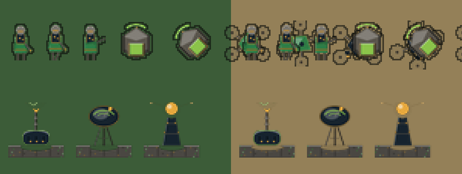
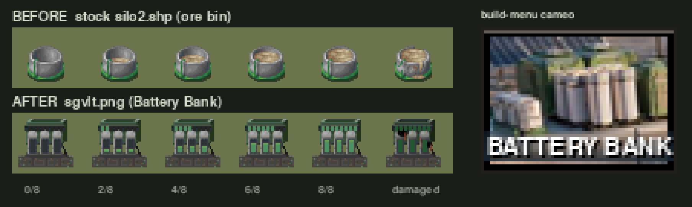
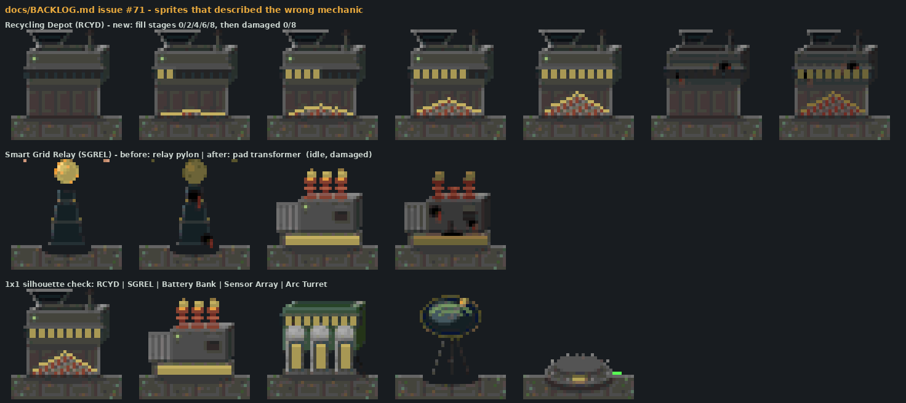
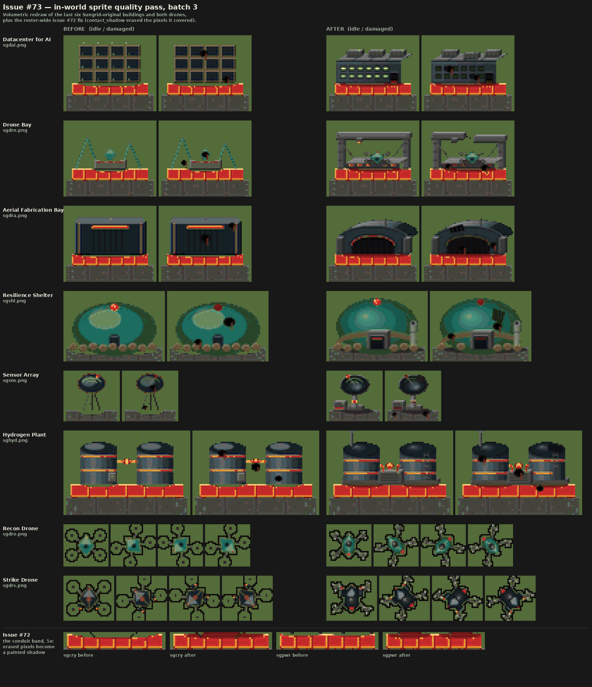
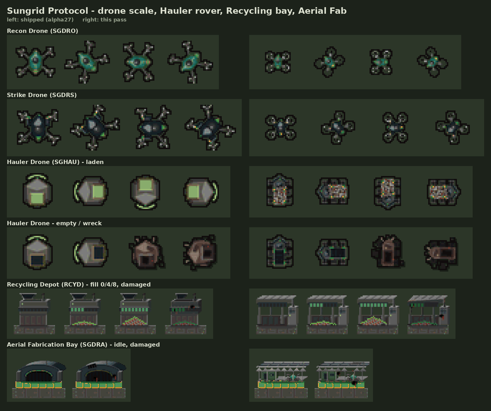
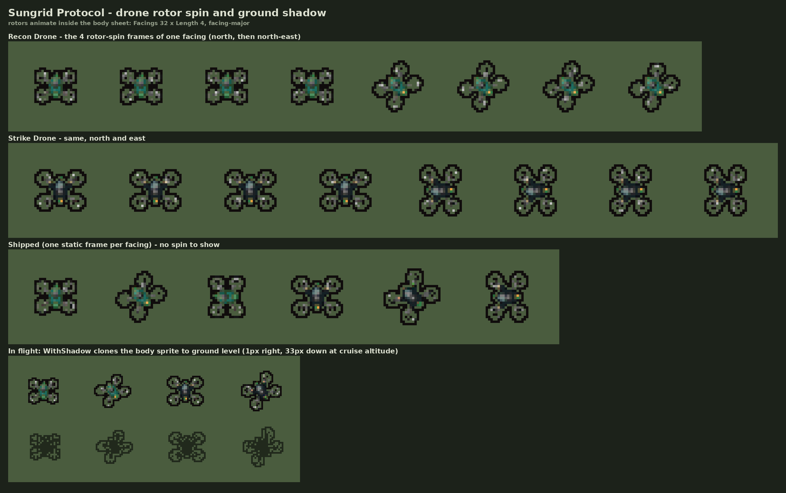

# Sungrid Protocol — Art Direction

## Tone

Lush eco-solarpunk. Renewable power, smart grids, drone logistics, and resilient settlements — hopeful and strategic, not utopian or goofy. This is still a real RTS: the world should look like people building something worth defending, under genuine pressure, not a post-scarcity diorama with no stakes.

## Guardrails

- **Not utopian.** Bases should show wear, improvisation, and defense — sandbags next to solar panels, drone bays bolted onto salvaged structure, not pristine architecture-magazine renders.
- **Not goofy.** No cartoon mascots, no winking irony. The Cryptominer building (morally ambiguous legacy tech repurposed under solar power) is the tone reference: interesting, slightly uneasy, not a joke.
- **Still a Cold-War-adjacent conflict, re-skinned.** Military tension, scouting, raiding, and destruction are real and visible — weapons and defensive structures should read as dangerous, not decorative.

## Readability rules (non-negotiable, ties to Design Pillar 1)

- Every unit and building must have a distinct, readable silhouette at standard RTS zoom — theme never overrides legibility.
- Faction/player color must remain the dominant, unambiguous ownership signal (team-color accents on structures/units), consistent with classic RA-style UI conventions.
- Health/status bars, selection indicators, and UI chrome keep OpenRA's existing conventions until there's a specific, tested reason to deviate — familiarity is a feature for genre-literate players.

## Palette direction

- **Base palette:** greens (living systems, recycling, foliage reclaiming industrial space), warm solar-panel blues/blacks, sun-gold accents for "active/powered" states.
- **Military/industrial counterpoint:** desaturated grays and rust for legacy infrastructure (Cryptominer, salvaged structures) to visually separate "old world tech" from "new grid tech" without needing a second faction yet.
- **Danger/alert states:** reserve existing RTS conventions (red/amber) for low power, under-attack, and Grid Reserve Lockdown countdown states — don't reinvent alert color language.

## Faction visual differentiation (Phase 5+)

Until a second faction is scoped, "faction flavor" means making the single Sungrid Protocol roster visually cohesive and distinct from vanilla RA/Allies/Soviets — not inventing a second full art set. Notes for whenever a second faction is justified: differentiate through material and infrastructure philosophy (e.g. decentralized/drone-based vs. centralized/hardened grid) rather than through tone shifts — both factions should still read as "this world," not swap into a different genre.

## Asset pipeline (Phase 5 planning note)

Before more than one contributor (human or AI-assisted) produces art, lock: sprite resolution and frame conventions matching OpenRA's existing pixel-art pipeline, a shared base palette file, and a naming/sequence convention consistent with `mods/ra`'s existing structure so new sequences drop into the engine's existing tooling without custom loader work. This is a data/content-pipeline decision, not a code decision — see `docs/ARCHITECTURE.md` friction point #4.

**Priority: Solar Array first.** Solar Array (`POWR`/`APWR`) is the building the mod is named after, so it was the first to get dedicated art rather than the reused vanilla RA power plant sprite — see `docs/BACKLOG.md` issue #12. That first pass shipped as a `PngSheet`-format sprite rather than a hand-authored indexed `.shp`, so it does **not** yet establish the final sprite pipeline baseline this section calls for; it proves the palette/tone direction (solar-panel blues, gold power-conduit accent, green reclaiming the base) but still needs a real artist pass, at which point the indexed-palette/`.shp` pipeline baseline should get set properly.

**Follow-up: the rest of the Sungrid-original roster (see `docs/BACKLOG.md` issue #34).** The remaining buildings with no `mods/ra` equivalent — Cryptominer, Datacenter for AI, Drone Bay, Aerial Fabrication Bay, Grid Defense Turret, Smart Grid Relay, Resilience Shelter, Sensor Array, Wind Turbine Array, Hydrogen Plant — plus the two drone units (Recon Drone, Strike Drone) now have dedicated first-pass art too, generated the same programmatic way by `mods/sungrid/bits/gen_concept_art.py`. This closed a real readability bug, not just missing flavor: several of these buildings had been sharing an identical sprite with an unrelated existing building (worst case, `SGTUR`/`SGWND`/the real `SAM` Site all rendered the same sprite), which violates this document's non-negotiable distinct-silhouette rule above. Wind Turbine Array and Hydrogen Plant were deliberately drawn as palette/motif variants of Solar Array's own art rather than new designs from scratch, since they're mechanically just other power buildings — consistent with only drawing genuinely new motifs where the concept itself is new. `SGHAU` (Hauler Drone) was initially left on `HARV`'s chassis for the same reason in the other direction — mechanically just a small resource hauler, not a new concept — but that call was reversed in a follow-up pass: an identical sprite between the two isn't just missing flavor here, it's the exact distinct-silhouette violation this document's rule exists to prevent, and in practice it read as a gameplay bug (a Hauler Drone that looks exactly like an idle/broken Ore Truck, since it collects Scrap rather than Ore). `SGHAU` now has its own hex-chassis cargo-sled silhouette, deliberately not truck-shaped, with a rear cargo canister whose fill level reads its current Scrap load. As with Solar Array, this is programmatic art, not a real artist pass — that remains open follow-up work for the whole roster. **Two later changes supersede the description above:** the roster is no longer *flat* (issues #48/#58/#73 redrew every one of these with real volume at the game's overhead camera angle), and it is no longer in the locked palette below — issue #43 moved the whole set to indexed sprites on the stock RA player palette so team colour works, which shifts the locked greens to their nearest RA-palette entries. See those issues' sections for the current state.

**Follow-up: `ARCT`/`DISR` (see `docs/BACKLOG.md` issue #36).** `docs/BACKLOG.md` issue #14 renamed and re-weaponed Flame Tower/Flame Infantry into Arc Turret/Disruptor Trooper but deliberately kept the original `ftur.shp`/`e4.shp` chassis art on the "the models themselves were never the issue, only the weapon" reasoning — the same "easy to adapt" call `SGHAU` originally got, and it turned out to be the same mistake: a player sees a flame-nozzle tower and a flamethrower-armed trooper in the build menu, which reads as fire weapons still being in the game regardless of what the tooltip name says. Both now have dedicated first-pass art: `ARCT` is a squat discharge base with a forked electrode and a small arc bridging the two prongs (no nozzle/fuel-tank silhouette left anywhere, including the build-up animation, which was also switched off the flame-colored `fturmake.shp` reuse); `DISR` is a fully self-contained new infantry sheet — an abstract rotatable humanoid glyph carrying a blue-black-and-gold backpack discharge cell and a green weapon rod, with a gold spark accent standing in for the old flame jet during `shoot`.

**Follow-up: quality pass over the whole programmatic set (see `docs/BACKLOG.md` issue #40).** All of the above — the full issue #12/#34/#36 roster, Solar Array included — got a second, uniform rendering pass in `mods/sungrid/bits/gen_concept_art.py`: 4x supersampled drawing, one consistent top-left key light with lit/shaded edges on every mass, 1px dark readability outlines on all unit frames, genuinely distinct damaged frames (the first pass had a bug that made every building's damaged frame pixel-identical to idle), and sidebar icons rebuilt as opaque cameo cards instead of transparent whole-frame downscales. Frame sizes/counts/layouts are unchanged from the first pass, and it's still programmatic geometry in the locked palette — the real-artist-pass status above is unaffected.

**Follow-up: team/house color, and full-resolution cameos (see `docs/BACKLOG.md` issue #43).** The whole programmatic roster now ships as **indexed** sprites on the stock RA player palette instead of truecolor, so it finally obeys this document's own ownership guardrail above ("faction/player color must remain the dominant ownership signal"): the gold "grid-live" accent is mapped onto the player-color remap ramp (palette indices 80–95), so it recolors to each owner's team color exactly like the ported stock buildings, rather than a fixed gold that ignored ownership. This needs no rules/sequence changes — the actors already render on the default `player` palette; only the sprite pixel format changed. Cameos were also regenerated at full 64×48 (from 32×24). The 1-bit alpha of indexed sprites hardens the issue #40 anti-aliasing, which reads as more consistent with the stock RA indexed sprites; the earlier "signature green" emphasis was dropped as outdated, so the locked-green tones landing on their nearest RA-palette entries is acceptable. Still first-pass programmatic art — a real artist/`.shp` pass remains the open baseline this section calls for.

**Follow-up: infantry are authored differently from everything else here (see `docs/BACKLOG.md` issue #64).** A player rejected the Disruptor Trooper's sprite outright, and the cause was a pipeline mismatch rather than a shading one: `gen_concept_art.py` builds facings by drawing one master frame at 4x supersample and **rotating it in the image plane**, which is right for the top-down hardware it was written for (drones, the radially symmetric turret drum) and wrong for a humanoid, who has to stay upright and be *redrawn from each viewpoint*. Rotating a side-view trooper produced a man lying on his side in seven of eight facings. The rebuild established a second, deliberately separate track for figures, matching how the stock sheets in `mods/sungrid/bits` are actually made (measured by decoding `e6.shp` against `temperat.pal`):

- **Authored at native resolution in palette indices**, via the `PC` canvas — no supersample, no LANCZOS, no all-round outline. A stock infantry stand frame is ~95 pixels in ~10 indices with zero anti-aliasing; form comes from a small value ramp plus selective near-black rim pixels. The 4x-downscale-plus-outline recipe from issue #40 above is for buildings and vehicles, not for a 14px figure, where it just produces mush once the indexed pipeline's 1-bit alpha thresholds it.
- **Stock scale and stock anchoring:** ~5px wide, ~14px tall, with the **boots on the frame centre row** (stock puts the feet at the canvas centre and leaves the rest of the frame as slack). Getting this wrong doesn't only look wrong — it draws the unit away from where the actor actually stands.
- **A baked `ShadowIndex`-4 blob at the feet** on every frame, thrown to the lower right, exactly as every stock infantry frame has. Without it the figure floats while everything around it is anchored.
- **Body mass on the player-remap ramp (indices 80–95), identity on fixed accents.** Stock infantry uniforms are remapped; their character comes from small non-remap accents (e6's red toolbox, its yellow hard hat). That is a better reading of this document's ownership guardrail than issue #43's gold-accent-only remap, which on a figure this small left barely a pixel or two carrying the owner's colour. `DISR` keeps its gold visor slit, charge pip, hip cartridge and electric-white discharge as fixed accents on top of a team-coloured body.
- **Limbs must change material, not shade.** Stock puts light grey sleeves down both sides of a khaki torso; neighbouring steps of one ramp read as a single flat lump at this size.
- **Every facing drawn as a viewpoint** (back / three-quarter / profile / front), with torso width, pack coverage, visor, stride axis, weapon anchor and draw order all switching per facing. Frame 0 is north and frame indices advance counter-clockwise (confirmed against `heli.shp`'s 32-facing sheet).

Any future original humanoid actor follows this track, not `rotated_frames`. Still programmatic first-pass art, so the real-artist-pass status above is unaffected.

**Follow-up: rotating hardware is a third track — build the solid, then view it (see `docs/BACKLOG.md` issue #65).** Issue #64 above excused the Grid Defense Turret from the rotated-facings bug on the grounds that it is radially symmetric top-down hardware. Decoding the stock rotating turret (`sam2.shp`) showed that was wrong: a defence turret is a boxy object seen from an elevated camera, and the stock sheet keeps **227 pixels byte-identical across all 32 facings** because the mount is drawn once and only the superstructure is redrawn — as a genuine view of a solid, with the key light fixed in world space. Rotating one drawing instead spun the mount and its shading with the gun, and (because the pivot is the frame centre) made the mount visibly orbit as the turret tracked. So there are now three authoring tracks here, and the choice is about what the object *is*:

- **Buildings and static hardware:** draw one front-above elevation at 4× and downscale (the issue #40 recipe).
- **Figures:** author natively in palette indices, per facing (the issue #64 recipe above).
- **Rotating hardware:** build it once as a 3D solid and render each facing as a real viewpoint, via `Mesh` in `gen_concept_art.py`. Ground foreshortening is **2:1** and height is 1:1, measured off the stock 32-facing sheets. The mount stays out of the mesh and is drawn with ellipses so it is pixel-identical every facing; the barrel is mounted high and offset from the pivot so both its direction and the facing read at a glance; damage lives in the silhouette (a shorter barrel, a snapped rod), not only in decals.

Two things generalise beyond the turrets. **Cast shadows must be injected as `SHADOW_IDX`, not painted** — index 4 is a stencil, so it is excluded from the RGB→index search, and the roster's older `contact_shadow()` calls (drawn at alpha 70, below the 1-bit alpha threshold) have never produced a visible shadow at all. And **anything meant to glow has to be opaque**: translucent blooms are thresholded away by the same 1-bit alpha, which is why the Arc Turret's discharge is a hard zigzag with bright tip pixels rather than a soft halo.

A defence that turns should also *show* it turning: the Arc Turret's head was subsequently split off its body into its own 32-facing turret sprite (`docs/BACKLOG.md` issue #66), so both defence structures now point at what they are engaging rather than sitting at a fixed angle. The body sheet keeps only the pedestal — the fixed-mount half of the same rule.

**Follow-up: a reused stock sprite can be wrong about the *mechanic*, not just the theme (see `docs/BACKLOG.md` issue #70).** The Grid Reserve Vault — the building the mode's whole win condition runs through — was still rendering stock RA's `silo2.shp`, a rusty open-topped bin filling with ore. Every earlier silhouette fix in this document was about two actors looking alike; this one is different, and worse: the art was *legible and wrong*, telling the player the building stores ore when it banks Credits as grid capacity. Treat "does this sprite describe what the building actually does?" as a distinct check from "is this sprite distinguishable from its neighbours?" — a well-drawn, unambiguous sprite can still fail it.

Two constraints generalise from the replacement:

- **A fill-stage building has to stay readable at every stage, damaged included.** `WithResourceLevelSpriteBody` picks a frame by fill fraction, so `sgvlt.png` carries 9 charge stages *and* 9 damaged charge stages. The damaged half is the easy one to get wrong — issue #40's bug was 9 identical damaged frames — and here it also matters for play: Core Rule 4 cancels a Lockdown when Reserve drops below target, so hiding the level while a Vault is under fire hides the exact information a raid turns on. The level is double-coded: a discrete 8-segment gauge (countable stage by stage) plus a continuous bottom-up fill in each cell window (readable at RTS zoom, where 2px LEDs are not).
- **Team-colour accents must be stamped at native resolution.** `SUN_GOLD` is what routes onto the 80–95 remap ramp, but the 4× LANCZOS downscale reaches past a pixel's own block, so even a pixel-aligned gold segment picks up enough of the dark bezel beside it to land back on a *fixed* palette entry. The first pass produced a gauge whose segments alternated team-coloured and off-palette gold along its length. Accents on this recipe get re-stamped after the downscale (`_vlt_accents`/`sgvlt_frame`).

Also worth carrying forward: this building's mass is drawn to roughly the 24px tile it occupies rather than filling the 40px frame, so the rows of 4–6 Vaults the AI actually builds tile into one continuous battery farm instead of colliding.

**Follow-up: running that check across the roster found two more (see `docs/BACKLOG.md` issue #71).** The wrong-mechanic check above is only worth stating if it is actually run, so it was — and it caught two buildings the silhouette rule never would have:

- **Recycling Depot (`RCYD`)** was still rendering stock `oilb.shp`, an oil pumpjack, for a **Scrap refinery** that docks the Hauler Drone and stores what it brings in. Issue #47 had given it a dedicated cameo and deliberately left the world sprite on the derrick, so after issue #70 it was the last Sungrid-original-role building on borrowed art. Redrawn as a sorting hall under a shredder hopper with an open tipping bay, on the same fill-stage recipe as the Vault: a countable segment gauge plus a scrap heap whose profile grows with the level.
- **Smart Grid Relay (`SGREL`)** failed the check in the subtler direction — its relay pylon with radiating distribution lines depicted a **mechanic that does not exist**, since `docs/BUILDINGS.md` records the cluster-pooling idea as explicitly descoped and the shipped trait set is a flat `+60 Power`. A sprite can promise a capability as easily as it can misname one. Redrawn as a pad-mounted transformer.

One more constraint generalises, and it sharpens the team-colour rule above: **`draw_gold_band` is only safe on a band several pixels tall.** The 2×3 buildings' 8px band survives the downscale because it has interior rows; on a 1×1 plinth the band is 3px, every row is an edge row, and the entire band came back on *fixed* palette entries — a relay whose grid conduit ignored its owner's colour. Any accent thinner than about 4px needs the native re-stamp, not just the fiddly ones.

**Follow-up: the volumetric pass finished, and the painted-vs-stencil shadow rule got its exception (see `docs/BACKLOG.md` issue #73).** Batch 3 redrew the last six Sungrid-original buildings (Datacenter for AI, Drone Bay, Aerial Fabrication Bay, Resilience Shelter, Sensor Array, Hydrogen Plant) and both drones on the issue #48 vocabulary, adding two shapes to it: `Roof`, a receding top plane with an `at(u, v)` mapping so rooftop plant sits on the roof in the right perspective instead of floating over the eaves, and `sphere()`, a nested-ellipse ramp converging on a small off-centre highlight, which replaces `dome3d`'s three hand-placed blobs. Two silhouette calls are worth recording because they are what keep neighbouring buildings apart: the Datacenter and the Fabrication Bay are both enclosed halls, so one got a flat plant-covered roof and the other a barrel vault; and the Drone Bay's gantry masts and beam were given real box section, since 1px truss lines were effectively invisible on terrain.

The shadow rule above needs one correction. "Cast shadows must be injected as `SHADOW_IDX`, not painted" is right for a **turret**, whose pedestal leaves bare terrain around it. It is wrong for these buildings, and for two independent reasons. Mechanically, `indexed_strip` only writes `SHADOW_IDX` where the body frame is transparent, so a shadow landing on the building's own ground pad is discarded — the pad *is* the sprite. And by convention: decoding stock `fact.shp` (Construction Yard) against `temperat.pal` shows RA buildings bake **no long cast shadow at all**, just a 1–3px `ShadowIndex` rim hugging the lower edge of a silhouette that already fills its own frame. So the shadow one of these buildings needs is a *painted* pool on its own pad — opaque, and dimmed from whatever it lands on, which for the conduit band means dimming `SUN_GOLD` so the shadow stays on the remap ramp and darkens with the owner's colour instead of punching a grey bar through it.

That is also the fix for issue #72, which is the sharper form of the same 1-bit-alpha trap the glow rule above describes: `contact_shadow()` drawn at alpha 70 did not merely fail to darken, it **erased** every pixel it covered. All eight buildings with a conduit band were losing pixels out of the team-coloured band (28–161 per sheet); the two without one, the Shelter and the Sensor Array, had holes straight through the concrete pad. All are now zero. The same rule finished the drones: their rotors were translucent discs, so the discs were deleted outright and the drones read as a body ringed by four empty circles — they are now opaque blades with a single trailing tip streak, the solution issue #58's turbine blades already needed.

**Follow-up: a sprite is not one picture, it is a set of states (`docs/BACKLOG.md` issue #74).** Everything above is about making a better *idle frame*. What that left untouched is the rest of what the engine asks each actor to draw, which was still being answered with stock art or with a single held frame: no Sungrid building had a build-up (11 of 13 held one frame; two borrowed stock `gunmake.shp`), the three with death rubble pointed at RA's power-plant debris, and the Hauler Drone and both flying drones spawned stock husks on death — an Ore Truck, a Chinook and a Black Hawk. That last one matters most, because it silently undid a fix: issue #34's follow-up gave `SGHAU` its own chassis precisely so it could never be mistaken for `HARV`, and then killing it put `hhusk2.shp` — the Ore Truck wreck — back on the field.

Two rules come out of it. First, **derive a state from the finished sprite where the state is a transformation of it, and draw it by hand only where it is not.** A build-up is the finished mass rising, and decoding `fcommake.shp` confirms RA's own is exactly that — a squat version of the whole building growing to full height at constant footprint width — so `make_frames()` is a bottom-anchored vertical scale plus a monochrome tint, and 15 build-ups stay in step with their draw functions for free. Rubble and a husk are *not* transformations of the intact sprite; they need their own drawing, and they need to keep two or three recognisable pieces of the original in them so you can tell what you just killed.

Second, **the painted-vs-stencil shadow rule splits on whether the sprite fills its own frame**, which is the general form of the correction above. A standing building does, so it gets a painted pool. A wreck, a husk and a turret pedestal do not — they leave real terrain visible around themselves — so they get a `SHADOW_IDX` stencil, and `silhouette_shadow()` derives it from the frame's own silhouette offset down-right rather than from a second draw pass. The stock art draws the same line: `powrdead.shp` bakes 77 `ShadowIndex` pixels, `hhusk2.shp` bakes a shadow per facing, `fact.shp` bakes none.

One consequence worth stating outright, since it is a colour rule and not just an animation one: **a half-built structure must not be team-coloured.** Construction frames are greyed, greys sit far from the gold reference ramp, `_index_for` therefore lands them on fixed palette entries, and the owner's colour arrives with the finished frame — which is what stock RA does and what makes the completion moment read.

**Follow-up: scale, and drawing the thing rather than a symbol of it (`docs/BACKLOG.md` issue #80).** Four owner-reported reads, and each one turned out to be a different way of getting the *subject* wrong rather than the rendering:

- **Both drones were drawn at the wrong size.** A quadcopter that a squad carries in a backpack spanned 26×20 px, against ~14 px for the Disruptor Trooper and 24 px for the Hauler — on screen it was a gunship. Both are now ~15 px, and the detail was **redrawn, not scaled**: single-pixel booms, one lit facet instead of a three-facet ramp, and rotors as opaque *rings* instead of `rotor_blur`'s dashes-plus-streak, which at a 2 px radius collapses onto the same few pixels and (under the 1 px readability outline) turns each rotor into a spike whose direction changes every facing. The general rule: shrinking a sprite means re-choosing which marks survive, because everything below ~1 px of stroke either vanishes or welds to its neighbour.
- **The size fix ran into a second one.** Both drones mounted stock RA helicopter rotor discs (`lrotor`/`rrotor`, `yrotorlg`) as `WithIdleOverlay` on top of the four rotors their own sprite already bakes — two sets of blades, and after the shrink the 32–37 px stock discs were wider than the whole airframe. The overlays and their sequences are gone; the baked rings are per-facing correct and shrink with the body. **Ownership rule: an actor with a bespoke sprite should not also wear a generic overlay for a part its own sprite already draws.**
- **The Hauler Drone read as a household appliance.** Issue #34's follow-up moved `SGHAU` off `HARV`'s Ore Truck sprite by going as far from a truck as possible — a hex sled on skids with a level bar on the back. That satisfied "not `HARV`" and lost "is a harvester": a domed grey body with a green panel on it. Redrawn from the concept render (`concept-art/cameo-sources/desert_base2.png`, the same subject its photographic cameo is cut from) as the six-wheel scrap rover it depicts. **The load is now the readout** — actual scrap filling the bed and overtopping the rim, sharing the Recycling Depot's material palette — rather than a gauge standing in for it, so laden/empty reads from the silhouette at speed. It is still nothing like `HARV` in plan: long, narrow, six wheels proud of the hull, open bed.
- **The Recycling Depot read as a second Battery Bank.** Both were a closed box with a lit segment readout across its face; theme and colour do not separate two sprites that share a composition. It is now an open-sided **bay**: a wide flat canopy on slim posts, open at the front and both ends, with daylight between the roof and the pile underneath and the machinery (shredder jaw, feed chute, stack) pushed to one end so the outline stays posts-and-air. **When two actors collide, change what the outline is made of — a mass versus a frame — not the paint on it.**
- **The Aerial Fabrication Bay was legible and wrong.** A windowless barrel vault with a black arched mouth is a bunker or a kiln; nothing in it said aircraft, and nothing said solarpunk. Rebuilt from the same concept render as a pale space-frame hangar: a zigzag truss band along the front eave (nothing else in the roster has one, and it is what says *lightweight frame* rather than wall), a row of slim columns with daylight between them, a collector-panel field on the roof plane tying it back to the Solar Array family, and the airframes it builds parked underneath in plain sight. The truss web is drawn as **filled triangles, not diagonals**: a 5 px-deep band of 0.9 px lines comes back from the 4× downscale as a chain of soft loops, where solid triangles keep hard edges and leave the inverted triangles between them as real holes.

One cross-cutting note on scale consistency: the Drone Bay's *parked* airframe was shrunk in the same pass. A service pad whose model is bigger than the drone that lands on it reads as a different, larger aircraft — decorative copies of a unit have to track that unit's size.

**Follow-up: the first Sungrid-original animation, and where an animation should live (`docs/BACKLOG.md` issue #81).** Dropping the oversized stock rotor discs left the drones flying with dead rotors, so the spin was rebuilt — inside the body sheet, not as an overlay. Both drone sheets are now `Facings: 32` x `Length: 4` = 128 frames laid out facing-major, with each rotor's blade and bright tip advancing 90° per frame.

The choice is worth recording as a rule, because the obvious design (a small rotor sprite mounted with `WithIdleOverlay`, which is what stock RA does) is the wrong one *for art built this way*. An overlay is placed by a `WVec` that the engine rotates through `BodyOrientation.LocalToWorld`, which with the default `UseClassicPerspectiveFudge` shears the y axis by sin(40°) to fake a non-top-down camera. Our facings are made by rotating one top-down drawing in the image plane — a circle, not that ellipse. A rotor pinned to the north-facing boom tip therefore drifts about 2px off it by the time the drone faces west, on a 15px sprite. **So: if the facings were made by image-plane rotation, moving parts belong in the body sheet, where they rotate with the airframe and are exact by construction.** An overlay is right for a part whose art was drawn per-facing to the engine's perspective, or for one sitting on the actor's own axis.

Two consequences fall out of that choice, both of them the reason to prefer it here. `WithShadow` clones the body renderable, so a rotor drawn in the body sheet turns in the ground shadow too — no extra work. And it keeps the ownership rule above intact: the sprite draws its own rotors and wears no generic overlay for them.

On shadows, since the same request asked for them: every aircraft in the mod, drones included, inherits `WithShadow` from `^NeutralPlane` (`Offset: 43,128,0`, `ZOffset: -129`), which clones each non-decoration renderable, tints it black at alpha 140 and drops it to ground level. **The shadow matches the shape because it *is* the shape** — there is nothing per-actor to draw or maintain, and nothing to get wrong except removing the trait. At the default cruise altitude that puts it 1px right and 33px below the airframe.

Still open after this pass, and it is the *animated* half: no Sungrid **building** has a `WithIdleOverlay` or an animated body, against 27 animated `idle:`/`active:` nodes among the ported stock buildings. The Wind Turbine Array's blades do not turn, the Sensor Array's dish does not sweep, the Arc Turret fires with no muzzle flash, and the `grid-normal`/`grid-strained` and `drone-uplink` power states change behaviour with no visual cue whatsoever.

Every other Phase 2 building (the original economy/production roster ported from `mods/ra`) still ships with placeholder/reused stock art.

## Beyond building art: full visual identity (Phase 6/7)

Everything above governs building art specifically. Terrain tilesets, UI chrome (sidebar/build palette/radar frame), cursors, the main menu shell, unit/vehicle/infantry sprites, and audio (announcer voice lines, music) are all still unmodified stock OpenRA/RA assets as of Phase 5 — the single biggest reason the game still visually reads as "reskinned RA" rather than its own project, independent of how distinct the building roster becomes. `docs/ROADMAP.md`'s Phase 6 (world/UI reskin: terrain, chrome, cursors, main menu) and Phase 7 (unit sprites + audio) scope the work to close that gap; the guardrails, palette direction, and readability rules in this document apply equally to that work, not just buildings.

## Phase 6 chrome: first-pass reskin + locked palette (see `docs/BACKLOG.md` issue #13)

A first pass at the Phase 6 chrome deliverable is done: `mods/sungrid/uibits/dialog.png`, `sidebar.png`, and `loadscreen.png`(+`-2x`/`-3x`) are recolored from stock RA's beige/maroon toward this document's palette direction, using the concrete hex values below rather than the palette direction's prose alone. This is a scripted recolor (piecewise hue remap preserving exact canvas dimensions and `chrome.yaml`'s pixel-exact `Regions`/`PanelRegion` rects), not a real artist pass — see `mods/sungrid/uibits/PLACEHOLDER_ART.md` for exactly what's still placeholder and how to replace it. It also does **not** touch cursors or terrain tilesets, which remain out of scope for this pass (see that same file for why).

**Locked palette (hex, sRGB):**

| Role | Hex |
|---|---|
| Living green (primary) | `#2E7D46` |
| Living green (accent) | `#8BC34A` |
| Solar panel blue-black | `#16232E` |
| Sun-gold (active/powered) | `#E8A93D` |
| Alert red/amber | unchanged from stock, per the guardrail above |

**A real finding from doing this pass:** `sidebar.png`'s "no radar built yet" placeholder art and `loadscreen.png` turned out to contain the literal stock Allied chevron and Soviet hammer-and-sickle logos baked into pixel art, not just an unstyled color scheme. Both were replaced with a procedural placeholder emblem rather than left shipping unrelated faction IP while the rest of Phase 6 is still pending — see `PLACEHOLDER_ART.md` for the exact pixel locations if you're doing the real design pass.

### Follow-up pass: full chrome redesign, no stock-derived pixels (see `docs/BACKLOG.md` issue #41)

The recolor above was superseded by a from-scratch redesign: `mods/sungrid/uibits/gen_chrome.py` now generates all of `dialog.png`, `sidebar.png`, `loadscreen*.png`, and the mod icons programmatically — zero pixels derive from stock RA chrome, which was the last reason the UI itself still read as "recolored OpenRA." The visual language ("grid-glass") is built entirely from the locked palette above: solar-panel blue-black surfaces with a faint photovoltaic cell-grid texture, living-green structural frames with the same top-left lit-edge convention as the issue #40 sprite pass, and sun-gold reserved for highlighted/active states, filaments, and the redesigned emblem (a sun rising over a living-green horizon inside a hexagonal grid cell, filaments feeding an outer ring). Faction accents follow the issue #34 identities — Consortium gold, Assembly green. Every `chrome.yaml` pixel rect and canvas size is unchanged. Still programmatic first-pass art, not a human-designer pass — `mods/sungrid/uibits/PLACEHOLDER_ART.md` documents the current state and constraints.

## Phase 6 terrain: first-pass palette reskin (see `docs/BACKLOG.md` issue #18)

A first pass at the temperate tileset (the primary/most-used tileset per `docs/ROADMAP.md`'s Phase 6 deliverables) is done, using a different technique than the chrome pass: rather than editing individual tile sprites, `mods/sungrid/bits/reskin_terrain_palette.py` recolors the **palette**, not the tiles. Classic Westwood-era tile art is a fixed set of 256-color indices into a separate `.pal` file — the actual `.tem` sprite data never changes, only which color each index resolves to — so this carries none of the "a bad tile replacement can break cliff/resource-field boundary visuals across the whole map set" risk `docs/ROADMAP.md`'s Phase 6 section warns about from touching tile sprites directly.

This works cleanly because `mods/sungrid/rules/palettes.yaml` already has **separate** named palette entries for terrain (`PaletteFromFile@terrain-temperat`, `Name: terrain`) versus units/buildings (`PaletteFromFile@player`, `Name: player`) and effects (`PaletteFromFile@effect`), even though all three loaded from the same stock `temperat.pal` before this change. Repointing only `terrain`'s `Filename` at a new, mod-owned palette (`mods/sungrid/bits/sungrid-temperat-terrain.pal`) recolors terrain tiles and neutral scenery (trees, rocks — placed via the same `terrain` palette) without touching unit, building, or weapon-effect colors at all, which stay on the unmodified stock file.

The recolor itself is a piecewise hue remap in the same spirit as the chrome pass's `recolor_red_to_green`, tuned specifically for terrain: the dominant tan/khaki "clear ground" and rust/cliff hue band (roughly 0-45°) shifts toward this document's locked green, while a small set of near-pure bright highlights (existing ore/gem-marker gold glints) are nudged toward the locked sun-gold hex instead, so terrain reads as two distinct tones — living green ground, gold highlights — rather than a flat green wash. Water (blue hues) and rock/road grays are outside the touched band and are unchanged. Verified via `utility.sh --dump-sheets` (the same composited sprite-sheet-plus-palette rendering path the live game uses) against the stock render: ~22% of the tileset atlas's pixels changed, concentrated in ground/cliff texture, with cliff-face structure, tile boundaries, and water all visually intact — no missing or corrupted tiles.

**Scope of this pass:** temperate tileset only, per `docs/ROADMAP.md`'s explicit sequencing ("snow/desert are a follow-up within this phase or deferred to Phase 7"). Not yet confirmed in a live rendered client with a real camera view (only the composited sprite-sheet dump was verified in this pass) — that's the natural next check for whoever picks this up, alongside snow/desert if this direction holds up.

### Follow-up pass: snow and desert tilesets

Both tilesets are now recolored using the same palette-only technique, verified the same way (`--dump-sheets` diffed against stock), with one real per-tileset finding:

- **Snow:** the same full-strength recolor logic used for temperate applies directly. Snow's "universal" palette ranges (the shared sun-gold/rust/red bands the base VGA layout reuses across tilesets — verified byte-identical to temperate's copies of the same indices) recolor the same way, and snow's own dominant "clear ground" color is white/light gray (near-zero saturation), which the hue-based touch condition never matches — so the snow itself stays snow, and only the exposed dirt/rock patches breaking through it shift toward green ("moss reclaiming through the snow"). 79/256 entries changed, same count as temperate.
- **Desert:** the naive full-strength port does **not** work — desert's dominant "clear ground" color itself sits inside the same warm hue band (unlike temperate/snow, where it's a minority accent), so a straight port turns the entire visible sand surface solid green and erases the desert identity outright. A brightness-based taper (gradually reducing shift strength for brighter pixels) was tried first and still read as "green field," because so much of what actually looks like sand in the rendered tiles spans a wide brightness range, not just the very brightest highlight. What actually worked, confirmed visually via the composited sheet, was a **hard brightness cutoff**: only recolor entries at or below a value threshold (`--max-value=0.5` in `reskin_terrain_palette.py`), leaving the bright sunlit dune sand untouched and shifting only the darker shadowed crevices/rock toward green. 54/256 entries changed — visibly a distinct, deliberate accent, not a wash.

Both still carry the same open item temperate does: not yet confirmed in a live rendered client with a real camera view. **Status update (issue #49):** the `Launch.SkirmishBots` patch named below was subsequently built and run — a 4-player bot match now runs to conclusion with the local player correctly slotted at a real spawn — and the battlefield *still* renders black, because the render player's `Shroud` reports nothing explored. So this is no longer "no units, therefore no vision"; it is an unexplained shroud state, scoped as its own open blocker. Original note, kept for the trail: attempted again in this pass — a longer stabilization wait ruled out a timing issue, but the no-bots `Launch.Map` quick-load path genuinely has no starting units anywhere on the map, hence no vision/no rendered terrain at all, sidebar chrome aside.

## Concept drafts (non-canonical)

`docs/concept-art/phase5-building-dossier.html` is a schematic/silhouette sketch for the 7 Phase 5 buildings — palette and material intent only, not sprite art and not a substitute for the real pixel-art pass this section calls for. Open it directly in a browser. Treat it as a discussion starting point for a human (or dedicated art-pipeline) pass, not as an asset to ship.

`docs/concept-art/phase5-pixel-mockups.html` is a companion pass at the same 7 buildings redrawn as blocky, limited-palette faux pixel art (hard-edged vector cells standing in for pixels). Closer to how the buildings could read at a glance than the schematic dossier, but still not real indexed-palette `.shp` sprites — no animation frames, not exported through OpenRA's actual sprite pipeline. Same non-canonical status applies.
